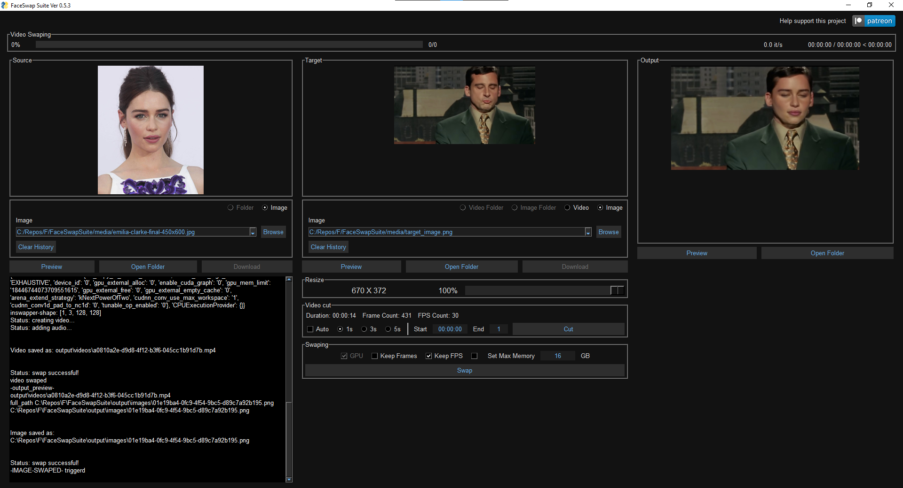

# FaceSwapSuite

Powered by [roop](https://github.com/s0md3v/roop) GPU only at this time.

Maybe add back simswap and other will see.

Need to add  progress bar and face restoration more info soon.

This UI is old and has a lot of simswap code and other things will clean later.

Some bugs: will save output twice, will fix later.

To Install click "install_FaceSwapSuite.bat" and wait for the UI will open at end of installtion.

To run click Run_FaceSwapSuite.bat

There is also GPU Speed boost version based on [Richard-roop](https://github.com/RichardErkhov/Richard-roop) but it was a little unstable maybe i am doing something wrong.

Try them both.

Installtion video:
https://www.youtube.com/watch?v=swWW2PO7qSE

Download: 
https://github.com/diStyApps/FaceSwapSuite/releases

Or clone the repo.

Support this project: https://www.patreon.com/distyx